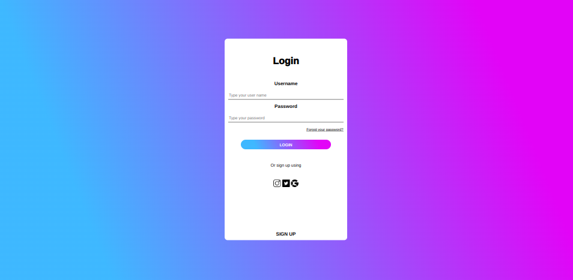

# Form com HTML e CSS

- Form. com HTML e CSS puro, esse foi um dos meus primeiros projetos, que a ideia e o layout foi pensado apenas por mim.
Como esse projeto faz um tempo que realizei, lembro que na época ainda não conseguia efetuar um site responsivo igual eu consigo hoje, é muito gratificante ver que você esta evoluindo em algo que você se dedica diariamente. 

## Table of contents

- [Overview](#overview)
  - [Screenshot](#screenshot)
- [My process](#my-process)
  - [Built with](#built-with)
- [Author](#author)

## Overview

### Screenshot

### Built with

- Semantic HTML5 markup
- CSS custom properties
- Flexbox

## Author

- Linkedin - [@AdrianoEscarabote](https://www.linkedin.com/in/adriano-escarabote-944b02233/)
- Instagram - [@godrian](https://www.instagram.com/ogdrian/)
